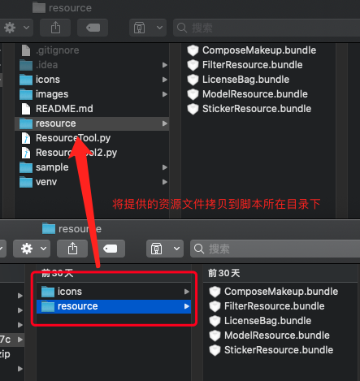
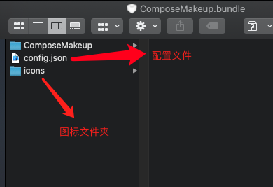

# 资源处理脚本使用指南
为了更为方便地在代码中加载和使用资源，需要对特效资源文件做一些处理，从而生成与之对应的 json 配置文件。您可以通过该脚本来快速方便地处理资源，并把处理过后的 resource 文件夹拷贝至您的工程中以便使用。具体使用方式请参考 demo 工程。

## 1. 环境
本目录下共提供了两个 Python 版本的脚本
  
 - Python 3.x 请使用 ResourceTool.py
 - Python 2.x 请使用 ResourceTool2.py
 
运行脚本会自动为您安装 [pypinyin](https://github.com/mozillazg/python-pinyin) 库，如若不成功请使用命令 `pip install pypinyin` 自行安装。

## 2. 使用
将提供的 resource 文件夹和 icons 文件夹(如果您购买了动态贴纸才有) 放到与该文件同级目录下



在该目录下根据您的 Python 版本和系统类型执行不同的命令，命令如下所示：  

| Python 版本 \ 系统     |  Android  |  iOS   |
| ------------------------------------ | --------   | -----------------  |
| **Python3.x** |  python ResourceTool.py Android | python ResourceTool.py iOS |
| **Python2.x** |  python ResourceTool2.py Android | python ResourceTool2.py iOS |

## 3. 修改脚本（可选）
如果您需要对某类特效的初始强度值进行指定，请编辑脚本文件中的初始强度变量，这部分代码在脚本文件的头部。可忽略此步骤，默认所有特效的初始强度值为 0.5。

```python
# 下面的变量分别对应美颜、美型、美体、美妆、滤镜特效的初始强度
# 如果想要具体设置某一种特效的初始强度，请在构建完 json 后自行依照 demo 中 resource 文件夹修改
beauty_intensity = 0.5
reshape_intensity = 0.5
body_intensity = 0.5
makeup_intensity = 0.5
filter_intensity = 0.5
```

## 4. 问题
### 4.1 Python 安装
可前往 [python官网](https://www.python.org/) 下载安装包，一键安装并设置环境变量，具体可参考 [Python 环境搭建](https://www.runoob.com/python/python-install.html)。
	
### 4.2 pip 安装与升级
Python 2.7.9+ 或 Python 3.4+ 以上版本都自带 pip 工具,如果您没有此工具请前往 [pip官网](https://pypi.org/project/pip) 下载安装，具体可参考 [pip 安装教程](https://www.runoob.com/w3cnote/python-pip-install-usage.html)。  
如果您的 pip 版本过低导致无法安装，可使用 `python -m pip install --upgrade pip` 来进行升级

### 4.3 如何修改图标与特效名称？
运行配置脚本后会为您的资源配置一份基本的 icon 和特效名称，如果想要自定义可以在脚本处理之后修改 config.json 文件与 icons 文件夹。美颜、微整形、美妆、美体的配置文件在 ComposeMakeup.bundle 下，滤镜的配置文件在 FilterResource.bundle 下，动态贴纸的配置文件在 StickerResource.bundle 下。  
修改示例：  
假如我想要修改美颜中美白的 icon 和特效名称  
1.美颜特效在 ComposeMakeup.bundle 下，打开该文件并找到 config.json，找到 effectName 为“美白”的一项，修改其 effectName 的值为新特效名称，修改其 iconName 的值为新的图标文件名称。




2.将在上一步修改的图标名称所对应的文件拷贝到 icons 文件夹中

### 4.4 多 Python 版本问题
建议使用电脑上默认 Python 版本来运行脚本，原因为运行脚本会为您安装 pypinyin 库到默认 Python 版本中，如果使用非默认 Python 版本运行可能会出现找不到 pypinyin 库的情况，可自行指定 Python 版本安装 pypinyin 库解决此问题。

### 4.5 异常情况
如果出现找不到图标或者某些资源识别不了的情况请按照提示自行修改，可参见我们的 [resource](../PLDroidShortVideoDemo/app/src/main/assets/resource) 文件夹，如果脚本处理失败也可其进行测试验证，判断是否为脚本问题。
